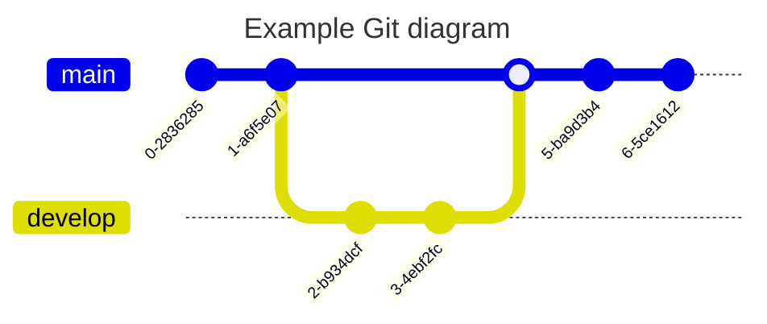

## 🦄 标签页（Tabs）


````markdown
:::tabs

== tab JavaScript

```js
const hello = "Hello World";
console.log(hello);
```

== tab TypeScript

```ts
const hello: string = "Hello World";
console.log(hello);
```

== tab Vue

```vue
<template>
  <div>{{ hello }}</div>
</template>

<script setup>
const hello = "Hello World";
</script>
```

:::

```

```
````

## 🐶 标题

# 我是 h1 标题

## 我是 h2 标题

### 我是 h3 标题

```markdown
# 我是 h1 标题

## 我是 h2 标题

### 我是 h3 标题
```

## 🐱 加粗

**I have a dream that one day this nation will rise up.**

```markdown
**I have a dream that one day this nation will rise up.**
```

## 🐭 斜体

_It is a dream deeply rooted in the American dream._

```markdown
_It is a dream deeply rooted in the American dream._
```

## 🐹 删除线

~~It is a dream deeply rooted in the American dream.~~

```markdown
~~It is a dream deeply rooted in the American dream.~~
```

## 🐻 超链接

[安知鱼博客](https://blog.anheyu.com)

```markdown
[安知鱼博客](https://blog.anheyu.com)
```

## 🐼 图片


```markdown

```

## 🙉 下划线

<u>So even though we face the difficulties of today and tomorrow, I still have a dream.</u>

```markdown
<u>So even though we face the difficulties of today and tomorrow, I still have a dream.</u>
```

## 🙊 上标


```markdown
I have a dream that one day this nation will rise up.^[1]^
```

## 🐒 下标


```markdown
I have a dream that one day this nation will rise up.~[2]~
```

## 🐰 行内代码

`md-editor-v3`

```markdown
`md-editor-v3`
```

## 🦊 块级代码

```js
import { ref } from "vue";
import { MdEditor } from "md-editor-v3";
import "md-editor-v3/lib/style.css";

const text = ref("Hello Editor!");
```

````markdown
```js
import { ref } from "vue";
import { MdEditor } from "md-editor-v3";
import "md-editor-v3/lib/style.css";

const text = ref("Hello Editor!");
```
````

## 🐻‍❄️ 引用

```markdown
> 引用：《I Have a Dream》
```

## 🐨 有序列表

1. So even though we face the difficulties of today and tomorrow, I still have a dream.
2. It is a dream deeply rooted in the American dream.
3. I have a dream that one day this nation will rise up.

```markdown
1. So even though we face the difficulties of today and tomorrow, I still have a dream.
2. It is a dream deeply rooted in the American dream.
3. I have a dream that one day this nation will rise up.
```

## 🐯 无序列表

- So even though we face the difficulties of today and tomorrow, I still have a dream.
- It is a dream deeply rooted in the American dream.
- I have a dream that one day this nation will rise up.

```markdown
- So even though we face the difficulties of today and tomorrow, I still have a dream.
- It is a dream deeply rooted in the American dream.
- I have a dream that one day this nation will rise up.
```

## 🦁 任务列表

- [ ] 周五
- [ ] 周六
- [x] 周天

```markdown
- [ ] 周五
- [ ] 周六
- [x] 周天
```

## 🐮 表格

| 表头 1 |  表头 2  | 表头 3 | 表头 4 |
| :----- | :------: | -----: | ------ |
| 左对齐 | 中间对齐 | 右对齐 | 默认   |

```markdown
| 表头 1 |  表头 2  | 表头 3 | 表头 4 |
| :----- | :------: | -----: | ------ |
| 左对齐 | 中间对齐 | 右对齐 | 默认   |
```

## 🐷 数学公式

### 🐽 行内


```markdown
$x+y^&#123;2x&#125;$
```

### 🐸 块级


```markdown
$$
\sqrt[3]&#123;x&#125;
$$
```

## 🐵 图表


````markdown

````

## 🙈 提示


```markdown
!!! note 支持的类型

note、abstract、info、tip、success、question、warning

failure、danger、bug、example、quote、hint、caution、error、attention

!!!

!!! success Title

!!!

!!! bug Title

!!!

!!! abstract Title

!!!

!!! attention Title

!!!

!!! caution Title

!!!

!!! danger Title

!!!

!!! error Title

!!!

!!! example Title

!!!
```

## 💰 付费内容 （PRO 版本专享）


### 基础用法

```markdown
:::paid-content
这是一段付费内容，只有购买后才能查看完整内容。

付费内容可以包含：

- 文字内容
- **格式化文本**
- `代码片段`
- > 引用内容

以及其他 Markdown 语法。
:::
```

### 自定义标题和价格

```markdown
:::paid-content title="高级教程" price="9.9" original-price="19.9" currency="¥"
这是一个自定义标题和价格的付费内容示例。

支持设置：

- 自定义标题
- 当前价格
- 原价（划线显示）
- 货币符号

当原价大于当前价格时，会显示限时特惠标识。
:::
```

### 参数说明

| 参数                    | 描述                 | 默认值     | 示例                    |
| ----------------------- | -------------------- | ---------- | ----------------------- |
| `title` 或 `paid-title` | 付费内容标题         | "付费内容" | `title="VIP教程"`       |
| `price`                 | 当前价格             | 1.0        | `price="9.9"`           |
| `original-price`        | 原价（用于显示优惠） | 0.0        | `original-price="19.9"` |
| `currency`              | 货币单位             | "¥"        | `currency="$"`          |

**注意**：`paid-title` 参数优先级高于 `title` 参数。

## 🎨 自定义 HTML 样式

### 彩色文字

<font color="#00ffff" size="7">
  青色大字体
</font>

```markdown
<font color="#00ffff" size="7">青色大字体</font>
```

### 文本对齐

<p style={{ textAlign: "center" }}>居中文字</p>
<p style={{ textAlign: "right" }}>右对齐文字</p>

```markdown
<p style={{textAlign: 'center'}}>居中文字</p>
<p style={{textAlign: 'right'}}>右对齐文字</p>
```

## 📝 编辑器特色功能

### 🔄 代码折叠

编辑器支持根据设置自动折叠超过指定行数的代码块，提升阅读体验。默认超过 10 行的代码会被自动折叠。

### 📋 一键复制

每个代码块都有复制按钮，点击即可复制代码。

### 🌙 主题切换

编辑器会自动根据网站主题切换明暗模式。

### 💾 自动保存

支持 Ctrl+S 快捷键保存内容。

### 🎯 智能表格

表格会自动添加容器包装，支持横向滚动，在移动端也能良好展示。
