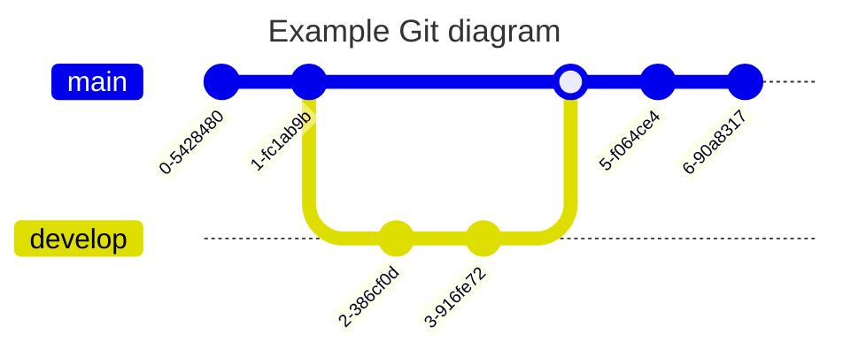
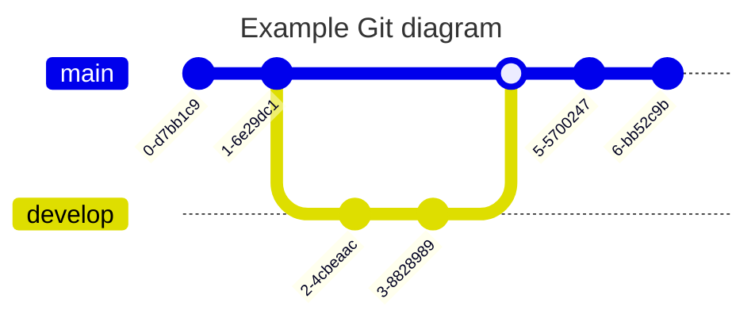

## 🦄 标签页（Tabs）


````markdown
:::tabs

== tab JavaScript

```js
const hello = "Hello World";
console.log(hello);
```

== tab TypeScript

```ts
const hello: string = "Hello World";
console.log(hello);
```

== tab React

```tsx
export function Hello() {
  const hello = "Hello World";
  return <div>{hello}</div>;
}
```

:::

```

```
````

### 指定默认激活的标签

```markdown
:::tabs active=2

== tab 第一个标签
内容 1

== tab 第二个标签
内容 2（默认激活）

== tab 第三个标签
内容 3

:::
```

## 📁 折叠框（Folding）

折叠框可以隐藏长内容，用户点击标题即可展开查看。


### 基础用法

```markdown
:::folding
折叠框标题
这是折叠框的内容，默认是收起状态。
支持 **Markdown** 语法。
:::
```

### 默认展开

```markdown
:::folding open
默认展开的折叠框
这个折叠框默认是展开状态。
:::
```

### 自定义颜色

```markdown
:::folding #FF6B9D
粉色折叠框
使用十六进制颜色值自定义边框和标题背景色。
:::
```

```markdown
:::folding open #42b983
绿色折叠框（默认展开）
同时设置展开状态和自定义颜色。
:::
```

## 🙈 隐藏内容（Hidden）


### 块级隐藏内容

```markdown
:::hidden
这是默认的隐藏内容，点击"查看隐藏内容"按钮后显示。
支持 **Markdown** 语法。
:::
```

### 自定义按钮文字

```markdown
:::hidden display=点击查看答案
这是一道题目的答案。
:::
```

### 自定义按钮颜色

```markdown
:::hidden display=查看彩蛋 bg=#FF6B9D color=#fff
这是一个彩蛋内容！
:::
```

### 行内隐藏内容

```markdown
这是一段文字，{hide display=查看}这部分内容被隐藏了{/hide}，点击按钮查看。

自定义颜色：{hide display=答案 bg=#42b983 color=#fff}正确答案是 42{/hide}
```

## 🔘 按钮（Button）


### 基础按钮

```markdown
{btn url=https://blog.anheyu.com text=访问博客}{/btn}
```

### 自定义图标

```markdown
{btn url=https://github.com text=GitHub icon=anzhiyu-icon-github-line}{/btn}
```

### 按钮颜色

支持的颜色：`blue`、`pink`、`red`、`purple`、`orange`、`green`

```markdown
{btn url=# text=蓝色按钮 color=blue}{/btn}
{btn url=# text=粉色按钮 color=pink}{/btn}
{btn url=# text=红色按钮 color=red}{/btn}
```

### 描边样式

```markdown
{btn url=# text=描边按钮 style=outline color=blue}{/btn}
```

### 更大尺寸

```markdown
{btn url=# text=大按钮 size=larger color=blue}{/btn}
```

### 块级布局

```markdown
{btn url=# text=块级按钮 layout=block}{/btn}
{btn url=# text=居中按钮 layout=block position=center}{/btn}
{btn url=# text=右对齐按钮 layout=block position=right}{/btn}
```

### 组合示例

```markdown
{btn url=https://blog.anheyu.com text=访问博客 icon=anzhiyu-icon-link color=blue size=larger layout=block position=center}{/btn}
```

## 🎯 按钮组（Btns）

按钮组用于展示多个带有图标和描述的大型按钮，特别适合用于展示团队成员、合作伙伴、友情链接等场景。

> **按钮组效果预览**：多个带有图标和描述的大型按钮，特别适合用于展示团队成员、合作伙伴、友情链接等场景。


### 基础用法

```markdown
:::btns

icon=anzhiyu-icon-shapes title=张三 url=https://example.com desc=前端工程师
icon=anzhiyu-icon-shapes title=李四 url=https://example.com desc=后端工程师
icon=anzhiyu-icon-shapes title=王五 url=https://example.com desc=UI 设计师

:::
```

### 使用列表格式

```markdown
:::btns

- icon=anzhiyu-icon-shapes title=张三 url=https://example.com desc=前端工程师
- icon=anzhiyu-icon-shapes title=李四 url=https://example.com desc=后端工程师
- icon=anzhiyu-icon-shapes title=王五 url=https://example.com desc=UI 设计师

:::
```

### 自定义列数

默认为 3 列，可以设置 1-6 列：

```markdown
:::btns cols=4

- icon=anzhiyu-icon-github-fill title=GitHub url=https://github.com desc=代码托管平台
- icon=anzhiyu-icon-twitter-fill title=Twitter url=https://twitter.com desc=社交媒体平台
- icon=anzhiyu-icon-bilibili-fill title=Bilibili url=https://bilibili.com desc=视频分享网站
- icon=anzhiyu-icon-wechat-fill title=微信 url=# desc=即时通讯工具

:::
```

### 按钮颜色

```markdown
:::btns cols=3

- icon=anzhiyu-icon-shapes title=蓝色成员 url=# desc=前端开发 color=blue
- icon=anzhiyu-icon-shapes title=粉色成员 url=# desc=设计师 color=pink
- icon=anzhiyu-icon-shapes title=绿色成员 url=# desc=后端开发 color=green

:::
```

### 样式风格

支持的样式：`default`、`card`、`simple`

```markdown
:::btns style=card

- icon=anzhiyu-icon-shapes title=卡片样式 url=# desc=使用卡片风格展示
- icon=anzhiyu-icon-shapes title=卡片样式 url=# desc=使用卡片风格展示

:::
```

### 参数说明

**容器参数**：`cols`（列数 1-6，默认 3）、`style`（`default`/`card`/`simple`）

**按钮参数**：

- `icon`：图标（必需），支持 AnZhiYu 图标、Iconify 图标、图片 URL
- `title`：标题（必需）
- `url`：链接地址
- `desc`：描述文字
- `color`：颜色（`blue`/`pink`/`red`/`purple`/`orange`/`green`）

## 🖼️ 图片组（Gallery）

图片组插件可以创建美观的网格布局图片展示，支持自定义列数、间距和图片宽高比等参数。

> **图片组效果预览**：创建美观的网格布局图片展示，支持自定义列数、间距和图片宽高比等参数。


### 基础用法

```markdown
:::gallery


:::
```

### 自定义列数

默认为 3 列，可以设置 1-6 列：

```markdown
:::gallery cols=4


:::
```

### 设置图片间距

```markdown
:::gallery gap=20px


:::
```

### 固定宽高比

让所有图片保持统一的宽高比：

```markdown
:::gallery ratio=16:9


:::
```

常用宽高比：

- `1:1` - 正方形
- `16:9` - 宽屏
- `4:3` - 传统屏幕
- `3:2` - 照片常用比例

### 组合参数

```markdown
:::gallery cols=3 gap=15px ratio=1:1


:::
```

### 参数说明

**容器参数**：`cols`（列数 1-6，默认 3）、`gap`（间距，默认 10px）、`ratio`（宽高比，如 16:9）

**图片格式**：使用标准 Markdown 图片语法 ``

## 🎬 视频画廊（Video Gallery）

视频画廊插件可以创建美观的网格布局视频展示，支持自定义列数、间距和视频宽高比等参数，非常适合展示教程视频、作品集、产品演示等。

> **视频画廊效果预览**：创建美观的网格布局视频展示，悬停时显示播放图标，支持原生视频控制器。

### 基础用法

```markdown
:::video-gallery
url=https://npm.elemecdn.com/anzhiyu-blog@1.1.6/img/post/wuhan/1.mp4 title=武汉风光 1
url=https://npm.elemecdn.com/anzhiyu-blog@1.1.6/img/post/wuhan/2.mp4 title=武汉风光 2
:::
```

### 自定义列数

默认为 2 列，可以设置 1-4 列：

```markdown
:::video-gallery cols=3
url=视频地址 1 title=视频标题 1
url=视频地址 2 title=视频标题 2
url=视频地址 3 title=视频标题 3
:::
```

### 设置视频间距

```markdown
:::video-gallery gap=20px
url=视频地址 1 title=视频 1
url=视频地址 2 title=视频 2
:::
```

### 固定宽高比

让所有视频保持统一的宽高比：

```markdown
:::video-gallery ratio=16:9
url=视频地址 1 title=宽屏视频 1
url=视频地址 2 title=宽屏视频 2
:::
```

常用宽高比：

- `16:9` - 宽屏（默认）
- `4:3` - 传统屏幕
- `1:1` - 正方形

### 添加封面图和描述

```markdown
:::video-gallery
url=视频地址 1 title=教程视频 poster=封面图地址 desc=详细的教程说明
url=视频地址 2 title=演示视频 poster=封面图地址 desc=功能演示
:::
```

### 组合参数

```markdown
:::video-gallery cols=2 gap=20px ratio=16:9
url=https://npm.elemecdn.com/anzhiyu-blog@1.1.6/img/post/wuhan/1.mp4 title=武汉风光 1 desc=美丽的武汉城市风光
url=https://npm.elemecdn.com/anzhiyu-blog@1.1.6/img/post/wuhan/2.mp4 title=武汉风光 2 desc=夜晚的武汉
:::
```

### 参数说明

**容器参数**：`cols`（列数 1-4，默认 2）、`gap`（间距，默认 16px）、`ratio`（宽高比，默认 16:9）

**视频参数**：`url`（必填）、`title`、`poster`（封面图）、`desc`

## 🎵 音乐播放器（Music Player）


音乐播放器插件可以在文章中嵌入美观的网易云音乐播放器，支持播放、暂停、进度控制等功能，进度条颜色会自动匹配封面主色。

> **音乐播放器效果预览**：创建精美的音乐卡片，显示封面、歌曲名、歌手，支持播放控制和进度拖动。

### 基础用法

```markdown
{music id=554241732}{/music}
```

只需提供网易云音乐的歌曲 ID，系统会自动获取歌曲信息、封面、音频 URL，并提取封面主色用于进度条。

### 获取歌曲 ID

1. 打开网易云音乐网页版或客户端
2. 找到你喜欢的歌曲
3. 复制歌曲链接，ID 就是链接中的数字

例如：`https://music.163.com/#/song?id=554241732`，ID 就是 `554241732`

### 使用示例

**单首歌曲**

```markdown
{music id=554241732}{/music}
```

**多首歌曲列表**

```markdown
{music id=554241732}{/music}

{music id=1974443814}{/music}

{music id=1868553}{/music}
```

## 🎨 行内样式


### 下划线

```markdown
{u}这是下划线文字{/u}

{u color=#FF6B9D}这是彩色下划线{/u}
```

### 着重号

```markdown
{emp}这是着重号文字{/emp}

{emp color=#42b983}这是彩色着重号{/emp}
```

### 波浪线

```markdown
{wavy}这是波浪线文字{/wavy}

{wavy color=#FF6B9D}这是彩色波浪线{/wavy}
```

### 删除线（自定义样式）

```markdown
{del}这是删除线文字{/del}

{del color=#999}这是灰色删除线{/del}
```

### 键盘样式

```markdown
按 {kbd}Ctrl{/kbd} + {kbd}S{/kbd} 保存文件

{kbd color=#42b983}Enter{/kbd}
```

### 密码样式

```markdown
密码是：{psw}password123{/psw}

{psw color=#000}hidden-text{/psw}
```

## 🐶 标题

# 我是 h1 标题

## 我是 h2 标题

### 我是 h3 标题

```markdown
# 我是 h1 标题

## 我是 h2 标题

### 我是 h3 标题
```

## 🐱 加粗

**I have a dream that one day this nation will rise up.**

```markdown
**I have a dream that one day this nation will rise up.**
```

## 🐭 斜体

_It is a dream deeply rooted in the American dream._

```markdown
_It is a dream deeply rooted in the American dream._
```

## 🐹 删除线

~~It is a dream deeply rooted in the American dream.~~

```markdown
~~It is a dream deeply rooted in the American dream.~~
```

## 🐻 超链接

[安知鱼博客](https://blog.anheyu.com)

```markdown
[安知鱼博客](https://blog.anheyu.com)
```

## 🐼 图片

编辑器支持增强的图片语法，可以添加描述、设置尺寸、调整对齐方式等。

### 基础用法


```markdown

```

### 图片标题（鼠标悬停提示）

图片的第三个参数是标题（title），鼠标悬停时会显示。

```markdown

```

### 图片描述（Caption）

使用 `{caption="描述文字"}` 为图片添加底部描述文字，会渲染为 `<figcaption>` 标签。

```markdown
{caption="这是图片描述"}
```

**渲染结果：**

```html
<figure class="image-figure image-align-center">
  
  <figcaption>这是图片描述</figcaption>
</figure>
```

### 图片尺寸

使用 `{width=宽度 height=高度}` 设置图片尺寸（单位：像素）。

```markdown
{width=800 height=600}
```

### 图片对齐方式

使用 `{align=对齐方式}` 设置图片对齐，支持 `left`、`center`、`right`。

```markdown
{align=left}
{align=center}
{align=right}
```

**注意：** 默认对齐方式为 `center`（居中）。

### 组合使用

```markdown
{caption="底部描述" width=800 align=center}
```

**增强属性**：`caption`（底部描述）、`width`/`height`（尺寸）、`align`（对齐：left/center/right）

## 🙉 下划线

<u>So even though we face the difficulties of today and tomorrow, I still have a dream.</u>

```markdown
<u>So even though we face the difficulties of today and tomorrow, I still have a dream.</u>
```

## 🙊 上标


```markdown
I have a dream that one day this nation will rise up.^[1]^
```

## 🐒 下标


```markdown
I have a dream that one day this nation will rise up.~[2]~
```

## 🐰 行内代码

`md-editor-v3`

```markdown
`md-editor-v3`
```

## 🦊 块级代码

```tsx
import { useState } from "react";

export function EditorDemo() {
  const [text, setText] = useState("Hello Editor!");
  return <pre>{text}</pre>;
}
```

````markdown
```tsx
import { useState } from "react";

export function EditorDemo() {
  const [text, setText] = useState("Hello Editor!");
  return <pre>{text}</pre>;
}
```
````

## 🐻‍❄️ 引用

```markdown
> 引用：《I Have a Dream》
```

## 🐨 有序列表

1. So even though we face the difficulties of today and tomorrow, I still have a dream.
2. It is a dream deeply rooted in the American dream.
3. I have a dream that one day this nation will rise up.

```markdown
1. So even though we face the difficulties of today and tomorrow, I still have a dream.
2. It is a dream deeply rooted in the American dream.
3. I have a dream that one day this nation will rise up.
```

## 🐯 无序列表

- So even though we face the difficulties of today and tomorrow, I still have a dream.
- It is a dream deeply rooted in the American dream.
- I have a dream that one day this nation will rise up.

```markdown
- So even though we face the difficulties of today and tomorrow, I still have a dream.
- It is a dream deeply rooted in the American dream.
- I have a dream that one day this nation will rise up.
```

## 🦁 任务列表

- [ ] 周五
- [ ] 周六
- [x] 周天

```markdown
- [ ] 周五
- [ ] 周六
- [x] 周天
```

## 🐮 表格

| 表头 1 |  表头 2  | 表头 3 | 表头 4 |
| :----- | :------: | -----: | ------ |
| 左对齐 | 中间对齐 | 右对齐 | 默认   |

```markdown
| 表头 1 |  表头 2  | 表头 3 | 表头 4 |
| :----- | :------: | -----: | ------ |
| 左对齐 | 中间对齐 | 右对齐 | 默认   |
```

## 🐷 数学公式

### 🐽 行内


```markdown
$x+y^&#123;2x&#125;$
```

### 🐸 块级


```markdown
$$
\sqrt[3]&#123;x&#125;
$$
```

## 🐵 图表


```mermaid
---
title: Example Git diagram
---
gitGraph
   commit
   commit
   branch develop
   checkout develop
   commit
   commit
   checkout main
   merge develop
   commit
   commit
```

````markdown

```mermaid
---
title: Example Git diagram
---
gitGraph
   commit
   commit
   branch develop
   checkout develop
   commit
   commit
   checkout main
   merge develop
   commit
   commit
```
````

## 🙈 提示


```markdown
!!! note 支持的类型

note、abstract、info、tip、success、question、warning

failure、danger、bug、example、quote、hint、caution、error、attention

!!!

!!! success Title

!!!

!!! bug Title

!!!

!!! abstract Title

!!!

!!! attention Title

!!!

!!! caution Title

!!!

!!! danger Title

!!!

!!! error Title

!!!

!!! example Title

!!!
```

## 💰 付费内容 （PRO 版本专享）


### 基础用法

```markdown
:::paid-content
这是一段付费内容，只有购买后才能查看完整内容。

付费内容可以包含：

- 文字内容
- **格式化文本**
- `代码片段`
- > 引用内容

以及其他 Markdown 语法。
:::
```

### 自定义标题和价格

```markdown
:::paid-content title="高级教程" price="9.9" original-price="19.9" currency="¥"
这是一个自定义标题和价格的付费内容示例。

支持设置：

- 自定义标题
- 当前价格
- 原价（划线显示）
- 货币符号

当原价大于当前价格时，会显示限时特惠标识。
:::
```

### 参数说明

| 参数                    | 描述                 | 默认值     | 示例                    |
| ----------------------- | -------------------- | ---------- | ----------------------- |
| `title` 或 `paid-title` | 付费内容标题         | "付费内容" | `title="VIP教程"`       |
| `price`                 | 当前价格             | 1.0        | `price="9.9"`           |
| `original-price`        | 原价（用于显示优惠） | 0.0        | `original-price="19.9"` |
| `currency`              | 货币单位             | "¥"        | `currency="$"`          |

**注意**：`paid-title` 参数优先级高于 `title` 参数。

## 🎨 自定义 HTML 样式

### 彩色文字

<font color="#00ffff" size="7">
  青色大字体
</font>

```markdown
<font color="#00ffff" size="7">青色大字体</font>
```

### 文本对齐

<p style={{ textAlign: "center" }}>居中文字</p>
<p style={{ textAlign: "right" }}>右对齐文字</p>

```markdown
<p style={{textAlign: 'center'}}>居中文字</p>
<p style={{textAlign: 'right'}}>右对齐文字</p>
```

## 🔗 链接卡片（LinkCard）

链接卡片可以创建美观的链接展示，支持自定义图标、标题和描述信息。


### 基础用法

```markdown
{linkcard url=https://blog.anheyu.com title=安知鱼 sitename=AnZhiYu}{/linkcard}
```

### 自定义图标

#### 字体图标

```markdown
{linkcard url=https://github.com title=GitHub sitename=代码托管平台 icon=anzhiyu-icon-github}{/linkcard}
```

#### HTTP 图标链接

```markdown
{linkcard url=https://www.google.com title=Google sitename=搜索引擎 icon=https://www.google.com/favicon.ico}{/linkcard}

{linkcard url=https://github.com title=GitHub sitename=代码托管平台 icon=https://github.githubassets.com/favicons/favicon-dark.png}{/linkcard}
```

### 自定义提示文本

```markdown
{linkcard url=https://www.google.com title=Google sitename=搜索引擎 tips=访问搜索引擎}{/linkcard}
```

### 参数说明

| 参数     | 说明     | 默认值            |
| -------- | -------- | ----------------- |
| url      | 链接地址 | #                 |
| title    | 链接标题 | 链接标题          |
| sitename | 网站名称 | 网站名称          |
| icon     | 图标     | anzhiyu-icon-link |
| tips     | 提示文本 | 引用站外地址      |

## 💡 提示框（Tip）（PRO 版本专享）

Tip 插件可以创建各种样式的提示信息，支持鼠标悬停和点击触发。


### 基础用法

```markdown
{tip text=鼠标悬停提示 content=这是一个基础的悬停提示}{/tip}
```

### 点击触发

```markdown
{tip text=点击我查看提示 content=这是一个点击触发的提示 trigger=click}{/tip}
```

### 不同主题

```markdown
{tip text=成功提示 content=操作成功完成！ theme=success}{/tip}
{tip text=信息提示 content=这是一条信息提示 theme=info}{/tip}
{tip text=警告提示 content=请注意这个警告 theme=warning}{/tip}
{tip text=错误提示 content=发生了一个错误 theme=error}{/tip}
{tip text=浅色主题 content=这是浅色主题的提示 theme=light}{/tip}
```

### 不同位置

```markdown
{tip text=顶部显示 content=提示显示在顶部 position=top}{/tip}
{tip text=底部显示 content=提示显示在底部 position=bottom}{/tip}
{tip text=左侧显示 content=提示显示在左侧 position=left}{/tip}
{tip text=右侧显示 content=提示显示在右侧 position=right}{/tip}
```

### 自定义延迟

```markdown
{tip text=快速显示 content=立即显示的提示 delay=0}{/tip}
{tip text=延迟显示 content=延迟 500ms 显示的提示 delay=500}{/tip}
```

### 参数说明

| 参数     | 说明        | 可选值                                | 默认值 |
| -------- | ----------- | ------------------------------------- | ------ |
| text     | 显示文本    | -                                     | -      |
| content  | 提示内容    | -                                     | -      |
| theme    | 主题样式    | dark/light/info/warning/error/success | dark   |
| position | 显示位置    | top/bottom/left/right                 | top    |
| trigger  | 触发方式    | hover/click                           | hover  |
| delay    | 延迟时间 ms | -                                     | 300    |

## 📝 编辑器特色功能

### 🔄 代码折叠

编辑器支持根据设置自动折叠超过指定行数的代码块，提升阅读体验。默认超过 10 行的代码会被自动折叠。

### 📋 一键复制

每个代码块都有复制按钮，点击即可复制代码。

### 🌙 主题切换

编辑器会自动根据网站主题切换明暗模式。

### 💾 自动保存

支持 Ctrl+S 快捷键保存内容。

### 🎯 智能表格

表格会自动添加容器包装，支持横向滚动，在移动端也能良好展示。
