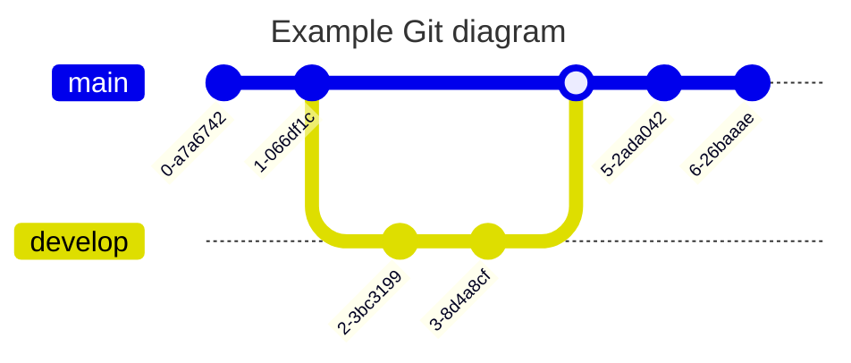

## 🦄 标签页（Tabs）


````markdown
:::tabs

== tab JavaScript

```js
const hello = "Hello World";
console.log(hello);
```

== tab TypeScript

```ts
const hello: string = "Hello World";
console.log(hello);
```

== tab Vue

```vue
<template>
  <div>{{ hello }}</div>
</template>

<script setup>
const hello = "Hello World";
</script>
```

:::

```

```
````

### 指定默认激活的标签

```markdown
:::tabs active=2

== tab 第一个标签
内容 1

== tab 第二个标签
内容 2（默认激活）

== tab 第三个标签
内容 3

:::
```

## 📁 折叠框（Folding）

折叠框可以隐藏长内容，用户点击标题即可展开查看。


### 基础用法

```markdown
:::folding
折叠框标题
这是折叠框的内容，默认是收起状态。
支持 **Markdown** 语法。
:::
```

### 默认展开

```markdown
:::folding open
默认展开的折叠框
这个折叠框默认是展开状态。
:::
```

### 自定义颜色

```markdown
:::folding #FF6B9D
粉色折叠框
使用十六进制颜色值自定义边框和标题背景色。
:::
```

```markdown
:::folding open #42b983
绿色折叠框（默认展开）
同时设置展开状态和自定义颜色。
:::
```

## 🙈 隐藏内容（Hidden）


### 块级隐藏内容

```markdown
:::hidden
这是默认的隐藏内容，点击"查看隐藏内容"按钮后显示。
支持 **Markdown** 语法。
:::
```

### 自定义按钮文字

```markdown
:::hidden display=点击查看答案
这是一道题目的答案。
:::
```

### 自定义按钮颜色

```markdown
:::hidden display=查看彩蛋 bg=#FF6B9D color=#fff
这是一个彩蛋内容！
:::
```

### 行内隐藏内容

```markdown
这是一段文字，{hide display=查看}这部分内容被隐藏了{/hide}，点击按钮查看。

自定义颜色：{hide display=答案 bg=#42b983 color=#fff}正确答案是 42{/hide}
```

## 🔘 按钮（Button）


### 基础按钮

```markdown
{btn url=https://blog.anheyu.com text=访问博客}{/btn}
```

### 自定义图标

```markdown
{btn url=https://github.com text=GitHub icon=anzhiyu-icon-github-line}{/btn}
```

### 按钮颜色

支持的颜色：`blue`、`pink`、`red`、`purple`、`orange`、`green`

```markdown
{btn url=# text=蓝色按钮 color=blue}{/btn}
{btn url=# text=粉色按钮 color=pink}{/btn}
{btn url=# text=红色按钮 color=red}{/btn}
```

### 描边样式

```markdown
{btn url=# text=描边按钮 style=outline color=blue}{/btn}
```

### 更大尺寸

```markdown
{btn url=# text=大按钮 size=larger color=blue}{/btn}
```

### 块级布局

```markdown
{btn url=# text=块级按钮 layout=block}{/btn}
{btn url=# text=居中按钮 layout=block position=center}{/btn}
{btn url=# text=右对齐按钮 layout=block position=right}{/btn}
```

### 组合示例

```markdown
{btn url=https://blog.anheyu.com text=访问博客 icon=anzhiyu-icon-link color=blue size=larger layout=block position=center}{/btn}
```

## 🎯 按钮组（Btns）

按钮组用于展示多个带有图标和描述的大型按钮，特别适合用于展示团队成员、合作伙伴、友情链接等场景。

> **按钮组效果预览**：多个带有图标和描述的大型按钮，特别适合用于展示团队成员、合作伙伴、友情链接等场景。


### 基础用法

```markdown
:::btns

icon=anzhiyu-icon-shapes title=张三 url=https://example.com desc=前端工程师
icon=anzhiyu-icon-shapes title=李四 url=https://example.com desc=后端工程师
icon=anzhiyu-icon-shapes title=王五 url=https://example.com desc=UI 设计师

:::
```

### 使用列表格式

```markdown
:::btns

- icon=anzhiyu-icon-shapes title=张三 url=https://example.com desc=前端工程师
- icon=anzhiyu-icon-shapes title=李四 url=https://example.com desc=后端工程师
- icon=anzhiyu-icon-shapes title=王五 url=https://example.com desc=UI 设计师

:::
```

### 自定义列数

默认为 3 列，可以设置 1-6 列：

```markdown
:::btns cols=4

- icon=anzhiyu-icon-github-fill title=GitHub url=https://github.com desc=代码托管平台
- icon=anzhiyu-icon-twitter-fill title=Twitter url=https://twitter.com desc=社交媒体平台
- icon=anzhiyu-icon-bilibili-fill title=Bilibili url=https://bilibili.com desc=视频分享网站
- icon=anzhiyu-icon-wechat-fill title=微信 url=# desc=即时通讯工具

:::
```

### 按钮颜色

```markdown
:::btns cols=3

- icon=anzhiyu-icon-shapes title=蓝色成员 url=# desc=前端开发 color=blue
- icon=anzhiyu-icon-shapes title=粉色成员 url=# desc=设计师 color=pink
- icon=anzhiyu-icon-shapes title=绿色成员 url=# desc=后端开发 color=green

:::
```

### 样式风格

支持的样式：`default`、`card`、`simple`

```markdown
:::btns style=card

- icon=anzhiyu-icon-shapes title=卡片样式 url=# desc=使用卡片风格展示
- icon=anzhiyu-icon-shapes title=卡片样式 url=# desc=使用卡片风格展示

:::
```

### 参数说明

**容器参数**（在 `:::btns` 后指定）：

- `cols`: 列数，默认为 3，范围 1-6
- `style`: 样式风格，可选 `default`、`card`、`simple`

**按钮参数**：

- `icon`: 图标类名或图片链接（必需）
  - 图标类名：如 `anzhiyu-icon-user-3-fill`
  - 图片链接：支持 http:// 或 https:// 开头的图片 URL
- `title`: 按钮标题（必需）
- `url`: 链接地址，默认为 `#`
- `desc`: 描述文字（可选）
- `color`: 按钮颜色（可选），支持 `blue`、`pink`、`red`、`purple`、`orange`、`green`

### 实用示例：团队成员展示

```markdown
:::btns cols=3

- icon=anzhiyu-icon-shapes title=安知鱼 url=https://blog.anheyu.com desc=创始人·全栈开发 color=blue
- icon=anzhiyu-icon-shapes title=张小明 url=# desc=前端工程师 color=green
- icon=anzhiyu-icon-shapes title=李小红 url=# desc=UI/UX 设计师 color=pink
- icon=anzhiyu-icon-shapes title=王小刚 url=# desc=后端工程师 color=purple
- icon=anzhiyu-icon-shapes title=刘小丽 url=# desc=产品经理 color=orange
- icon=anzhiyu-icon-shapes title=赵小强 url=# desc=测试工程师 color=red

:::
```

### 实用示例：友情链接

```markdown
:::btns cols=4

- icon=anzhiyu-icon-link title=安知鱼博客 url=https://blog.anheyu.com desc=技术分享与生活记录
- icon=anzhiyu-icon-link title=Hexo url=https://hexo.io desc=快速、简洁的博客框架
- icon=anzhiyu-icon-link title=Vue.js url=https://vuejs.org desc=渐进式 JavaScript 框架
- icon=anzhiyu-icon-link title=TypeScript url=https://www.typescriptlang.org desc=JavaScript 的超集

:::
```

### 使用图片作为图标

icon 字段支持直接使用图片链接（http:// 或 https:// 开头）：

```markdown
:::btns cols=3

- icon=https://example.com/avatar1.jpg title=张三 url=https://example.com/user1
- icon=https://example.com/avatar2.jpg title=李四 url=https://example.com/user2
- icon=https://example.com/avatar3.jpg title=王五 url=https://example.com/user3

:::
```

图片会自动显示为圆形头像，带有白色边框。

## 🖼️ 图片组（Gallery）

图片组插件可以创建美观的网格布局图片展示，支持自定义列数、间距和图片宽高比等参数。

> **图片组效果预览**：创建美观的网格布局图片展示，支持自定义列数、间距和图片宽高比等参数。


### 基础用法

```markdown
:::gallery


:::
```

### 自定义列数

默认为 3 列，可以设置 1-6 列：

```markdown
:::gallery cols=4


:::
```

### 设置图片间距

```markdown
:::gallery gap=20px


:::
```

### 固定宽高比

让所有图片保持统一的宽高比：

```markdown
:::gallery ratio=16:9


:::
```

常用宽高比：

- `1:1` - 正方形
- `16:9` - 宽屏
- `4:3` - 传统屏幕
- `3:2` - 照片常用比例

### 组合参数

```markdown
:::gallery cols=3 gap=15px ratio=1:1


:::
```

### 参数说明

**容器参数**（在 `:::gallery` 后指定）：

- `cols`: 列数，默认为 3，范围 1-6
- `gap`: 图片间距，默认为 10px（支持 px、rem、em 单位）
- `ratio`: 图片宽高比（如 16:9、1:1），不设置则自适应图片原始尺寸

**图片格式**：

支持三种格式：

1. **Markdown 图片语法**（推荐）

   ```markdown
   
   ```

2. **HTML img 标签**

   ```markdown
   
   ```

3. **参数格式**
   ```markdown
   url=图片 URL alt=替代文本 title=图片标题 desc=图片描述
   ```

### 实用示例：作品展示

```markdown
:::gallery cols=3 ratio=1:1


:::
```

### 实用示例：照片墙

```markdown
:::gallery cols=4 gap=8px


:::
```

### 实用示例：视频封面展示

```markdown
:::gallery cols=2 ratio=16:9 gap=20px


:::
```

### 实用示例：单列大图

```markdown
:::gallery cols=1


:::
```

### 特性说明

**1. 响应式设计**

图片组会根据屏幕尺寸自动调整：

- **桌面端（>768px）**：保持设定的列数
- **平板端（≤768px）**：4-6 列自动调整为 3 列
- **手机端（≤500px）**：3-6 列自动调整为 2 列，2 列自动调整为 1 列

**2. 悬停效果**

- 图片轻微上浮
- 图片放大 1.05 倍
- 显示图片标题和描述（如果有）
- 添加阴影效果

**3. 图片懒加载**

所有图片自动启用懒加载（`loading="lazy"`），提高页面加载性能。

**4. 点击放大**

图片组与 Fancybox 集成，点击图片可以查看大图，支持：

- 全屏查看
- 左右切换
- 缩放功能

### 最佳实践

**1. 列数选择**

- **1 列**: 适合横幅图、大图展示
- **2 列**: 适合宽屏图片、视频封面
- **3 列**: 最常用的布局，适合作品集、相册
- **4 列**: 适合产品展示、照片墙
- **5-6 列**: 适合小图标、图标集合

**2. 宽高比使用**

- **不设置**: 图片保持原始比例，适合尺寸不一的图片
- **1:1**: 正方形，适合头像、LOGO、产品图
- **16:9**: 宽屏，适合视频封面、横幅
- **4:3**: 传统照片比例
- **3:2**: 相机照片常用比例

**3. 间距设置**

- **8-10px**: 紧凑布局，适合照片墙
- **15-20px**: 标准布局，最常用
- **25-30px**: 宽松布局，突出单张图片

**4. 性能优化**

- 单个图片组建议不超过 20 张
- 使用适当的图片尺寸（不要过大）
- 利用懒加载特性优化首屏加载
- 移动端建议使用较少的列数（2-3 列）

**5. 注意事项**

- 确保图片 URL 有效且可访问
- 使用相同尺寸的图片效果更佳
- 测试移动端显示效果
- 图片标题会在悬停时显示，建议添加有意义的标题

## 🎬 视频画廊（Video Gallery）

视频画廊插件可以创建美观的网格布局视频展示，支持自定义列数、间距和视频宽高比等参数，非常适合展示教程视频、作品集、产品演示等。

> **视频画廊效果预览**：创建美观的网格布局视频展示，悬停时显示播放图标，支持原生视频控制器。

### 基础用法

```markdown
:::video-gallery
url=https://npm.elemecdn.com/anzhiyu-blog@1.1.6/img/post/wuhan/1.mp4 title=武汉风光 1
url=https://npm.elemecdn.com/anzhiyu-blog@1.1.6/img/post/wuhan/2.mp4 title=武汉风光 2
:::
```

### 自定义列数

默认为 2 列，可以设置 1-4 列：

```markdown
:::video-gallery cols=3
url=视频地址 1 title=视频标题 1
url=视频地址 2 title=视频标题 2
url=视频地址 3 title=视频标题 3
:::
```

### 设置视频间距

```markdown
:::video-gallery gap=20px
url=视频地址 1 title=视频 1
url=视频地址 2 title=视频 2
:::
```

### 固定宽高比

让所有视频保持统一的宽高比：

```markdown
:::video-gallery ratio=16:9
url=视频地址 1 title=宽屏视频 1
url=视频地址 2 title=宽屏视频 2
:::
```

常用宽高比：

- `16:9` - 宽屏（默认）
- `4:3` - 传统屏幕
- `1:1` - 正方形

### 添加封面图和描述

```markdown
:::video-gallery
url=视频地址 1 title=教程视频 poster=封面图地址 desc=详细的教程说明
url=视频地址 2 title=演示视频 poster=封面图地址 desc=功能演示
:::
```

### 组合参数

```markdown
:::video-gallery cols=2 gap=20px ratio=16:9
url=https://npm.elemecdn.com/anzhiyu-blog@1.1.6/img/post/wuhan/1.mp4 title=武汉风光 1 desc=美丽的武汉城市风光
url=https://npm.elemecdn.com/anzhiyu-blog@1.1.6/img/post/wuhan/2.mp4 title=武汉风光 2 desc=夜晚的武汉
:::
```

### 参数说明

**容器参数**（在 `:::video-gallery` 后指定）：

- `cols`: 列数，默认为 2，范围 1-4
- `gap`: 视频间距，默认为 16px（支持 px、rem、em 单位）
- `ratio`: 视频宽高比（如 16:9、4:3），默认为 16:9

**视频参数**：

支持两种格式：

1. **参数格式**（推荐）

   ```markdown
   url=视频 URL title=视频标题 poster=封面图 URL desc=视频描述 type=视频类型
   ```

2. **HTML video 标签**
   ```markdown
   <video src="视频URL" poster="封面图URL" title="视频标题"></video>
   ```

**参数详细说明**：

- `url`: 视频地址（必填）
- `poster`: 视频封面图（可选）
- `title`: 视频标题（可选）
- `desc`: 视频描述（可选）
- `type`: 视频类型，如 mp4、webm、ogg（可选，会自动根据 URL 推断）

### 实用示例：教程视频展示

```markdown
:::video-gallery cols=2 ratio=16:9
url=https://example.com/tutorial1.mp4 title=教程第一集 poster=https://example.com/poster1.jpg desc=基础入门教程
url=https://example.com/tutorial2.mp4 title=教程第二集 poster=https://example.com/poster2.jpg desc=进阶技巧讲解
url=https://example.com/tutorial3.mp4 title=教程第三集 poster=https://example.com/poster3.jpg desc=实战案例演示
url=https://example.com/tutorial4.mp4 title=教程第四集 poster=https://example.com/poster4.jpg desc=项目实战
:::
```

### 实用示例：产品演示

```markdown
:::video-gallery cols=3 gap=15px
url=https://example.com/demo1.mp4 title=功能 A 演示 poster=https://example.com/demo1.jpg
url=https://example.com/demo2.mp4 title=功能 B 演示 poster=https://example.com/demo2.jpg
url=https://example.com/demo3.mp4 title=功能 C 演示 poster=https://example.com/demo3.jpg
:::
```

### 实用示例：单列重要视频

```markdown
:::video-gallery cols=1
url=https://npm.elemecdn.com/anzhiyu-blog@1.1.6/img/post/wuhan/1.mp4 title=重要发布会视频 desc=2024 年产品发布会完整视频
:::
```

### 特性说明

**1. 响应式设计**

视频画廊会根据屏幕尺寸自动调整：

- **桌面端（>1024px）**：保持设定的列数
- **平板端（768px-1024px）**：3-4 列自动调整为 2 列
- **手机端（≤768px）**：所有多列布局自动变为单列

**2. 悬停效果**

- 视频卡片轻微上浮（translateY(-2px)）
- 显示播放按钮图标
- 显示视频标题和描述（如果有）
- 添加阴影效果

**3. 视频播放功能**

- 原生 HTML5 视频控制器
- 支持播放、暂停、音量调节
- 支持全屏播放
- 支持播放速度调节
- 预加载视频元数据（`preload="metadata"`）

**4. 性能优化**

- 视频不会自动播放，节省带宽
- 只预加载元数据，不预加载完整视频
- 建议为视频添加封面图（poster），提升加载体验

### 最佳实践

**1. 列数选择**

- **1 列**: 适合重要视频、完整教程
- **2 列**: 最常用的布局，适合教程系列、演示视频
- **3 列**: 适合短视频集合、功能演示
- **4 列**: 适合短视频预览、视频缩略图

**2. 宽高比使用**

- **16:9**: 最常用的宽屏比例，适合大多数视频
- **4:3**: 传统视频比例
- **1:1**: 正方形，适合社交媒体视频

**3. 间距设置**

- **12-16px**: 标准布局，最常用
- **20-24px**: 宽松布局，突出单个视频
- **8-10px**: 紧凑布局，适合视频墙

**4. 封面图建议**

- 为每个视频添加有意义的封面图
- 封面图应清晰展示视频内容
- 使用与视频相同的宽高比
- 封面图尺寸建议：1280x720（16:9）或更高

**5. 视频格式**

- 推荐使用 MP4 格式（H.264 编码），兼容性最好
- WebM 格式作为备选方案
- 避免使用过大的视频文件

**6. 性能优化**

- 单个视频画廊建议不超过 10 个视频
- 使用 CDN 托管视频文件
- 压缩视频以减小文件大小
- 移动端建议使用 1-2 列布局

**7. 注意事项**

- 确保视频 URL 有效且可访问
- 建议添加视频标题和描述
- 测试移动端播放效果
- 视频会消耗较多流量，注意提示用户

### 支持的视频格式

- **MP4** (推荐) - `.mp4`, `.m4v`
- **WebM** - `.webm`
- **Ogg** - `.ogg`, `.ogv`

插件会自动根据视频 URL 的扩展名推断视频类型，也可以手动指定 `type` 参数。

## 🎨 行内样式


### 下划线

```markdown
{u}这是下划线文字{/u}

{u color=#FF6B9D}这是彩色下划线{/u}
```

### 着重号

```markdown
{emp}这是着重号文字{/emp}

{emp color=#42b983}这是彩色着重号{/emp}
```

### 波浪线

```markdown
{wavy}这是波浪线文字{/wavy}

{wavy color=#FF6B9D}这是彩色波浪线{/wavy}
```

### 删除线（自定义样式）

```markdown
{del}这是删除线文字{/del}

{del color=#999}这是灰色删除线{/del}
```

### 键盘样式

```markdown
按 {kbd}Ctrl{/kbd} + {kbd}S{/kbd} 保存文件

{kbd color=#42b983}Enter{/kbd}
```

### 密码样式

```markdown
密码是：{psw}password123{/psw}

{psw color=#000}hidden-text{/psw}
```

## 🐶 标题

# 我是 h1 标题

## 我是 h2 标题

### 我是 h3 标题

```markdown
# 我是 h1 标题

## 我是 h2 标题

### 我是 h3 标题
```

## 🐱 加粗

**I have a dream that one day this nation will rise up.**

```markdown
**I have a dream that one day this nation will rise up.**
```

## 🐭 斜体

_It is a dream deeply rooted in the American dream._

```markdown
_It is a dream deeply rooted in the American dream._
```

## 🐹 删除线

~~It is a dream deeply rooted in the American dream.~~

```markdown
~~It is a dream deeply rooted in the American dream.~~
```

## 🐻 超链接

[安知鱼博客](https://blog.anheyu.com)

```markdown
[安知鱼博客](https://blog.anheyu.com)
```

## 🐼 图片

编辑器支持增强的图片语法，可以添加描述、设置尺寸、调整对齐方式等。

### 基础用法


```markdown

```

### 图片标题（鼠标悬停提示）

图片的第三个参数是标题（title），鼠标悬停时会显示。

```markdown

```

### 图片描述（Caption）

使用 `{caption="描述文字"}` 为图片添加底部描述文字，会渲染为 `<figcaption>` 标签。

```markdown
{caption="这是图片描述"}
```

**渲染结果：**

```html
<figure class="image-figure image-align-center">
  
  <figcaption>这是图片描述</figcaption>
</figure>
```

### 图片尺寸

使用 `{width=宽度 height=高度}` 设置图片尺寸（单位：像素）。

```markdown
{width=800 height=600}
```

### 图片对齐方式

使用 `{align=对齐方式}` 设置图片对齐，支持 `left`、`center`、`right`。

```markdown
{align=left}
{align=center}
{align=right}
```

**注意：** 默认对齐方式为 `center`（居中）。

### 组合使用

可以同时使用多个参数：

```markdown
{caption="图片描述" width=800 align=center}
```

### 完整示例

```markdown
{caption="拍摄于 2024 年春天" width=1200 height=800 align=center}
```

**渲染为：**

```html
<figure class="image-figure image-align-center">
  
  <figcaption>拍摄于 2024 年春天</figcaption>
</figure>
```

### 参数说明

**Markdown 标准语法：**

```markdown

```

**增强属性（在图片后添加）：**

```markdown
{caption="描述文字" width=宽度 height=高度 align=对齐方式}
```

| 参数      | 说明           | 类型   | 可选值            | 默认值 |
| --------- | -------------- | ------ | ----------------- | ------ |
| `caption` | 图片底部描述   | string | -                 | -      |
| `width`   | 图片宽度（px） | number | -                 | -      |
| `height`  | 图片高度（px） | number | -                 | -      |
| `align`   | 对齐方式       | string | left/center/right | center |

### 注意事项

1. **caption 与 title 的区别**：
   - `title`：鼠标悬停时显示的提示文字
   - `caption`：图片下方的描述文字（figcaption）
2. **避免重复描述**：
   当同时设置 `title` 和 `caption` 时，系统会自动处理，避免描述文字重复显示。

3. **懒加载**：
   所有图片会自动启用懒加载，优化页面加载性能。

4. **响应式**：
   设置的宽度和高度在移动端会自动适配。

### 实用示例

**示例 1：带描述的居中图片**

```markdown
{caption="这是一张美丽的照片" align=center}
```

**示例 2：指定尺寸的左对齐图片**

```markdown
{width=200 height=200 align=left}
```

**示例 3：完整参数的图片**

```markdown
{caption="2024 新款产品" width=600 height=400 align=center}
```

## 🙉 下划线

<u>So even though we face the difficulties of today and tomorrow, I still have a dream.</u>

```markdown
<u>So even though we face the difficulties of today and tomorrow, I still have a dream.</u>
```

## 🙊 上标


```markdown
I have a dream that one day this nation will rise up.^[1]^
```

## 🐒 下标


```markdown
I have a dream that one day this nation will rise up.~[2]~
```

## 🐰 行内代码

`md-editor-v3`

```markdown
`md-editor-v3`
```

## 🦊 块级代码

```js
import { ref } from "vue";
import { MdEditor } from "md-editor-v3";
import "md-editor-v3/lib/style.css";

const text = ref("Hello Editor!");
```

````markdown
```js
import { ref } from "vue";
import { MdEditor } from "md-editor-v3";
import "md-editor-v3/lib/style.css";

const text = ref("Hello Editor!");
```
````

## 🐻‍❄️ 引用

```markdown
> 引用：《I Have a Dream》
```

## 🐨 有序列表

1. So even though we face the difficulties of today and tomorrow, I still have a dream.
2. It is a dream deeply rooted in the American dream.
3. I have a dream that one day this nation will rise up.

```markdown
1. So even though we face the difficulties of today and tomorrow, I still have a dream.
2. It is a dream deeply rooted in the American dream.
3. I have a dream that one day this nation will rise up.
```

## 🐯 无序列表

- So even though we face the difficulties of today and tomorrow, I still have a dream.
- It is a dream deeply rooted in the American dream.
- I have a dream that one day this nation will rise up.

```markdown
- So even though we face the difficulties of today and tomorrow, I still have a dream.
- It is a dream deeply rooted in the American dream.
- I have a dream that one day this nation will rise up.
```

## 🦁 任务列表

- [ ] 周五
- [ ] 周六
- [x] 周天

```markdown
- [ ] 周五
- [ ] 周六
- [x] 周天
```

## 🐮 表格

| 表头 1 |  表头 2  | 表头 3 | 表头 4 |
| :----- | :------: | -----: | ------ |
| 左对齐 | 中间对齐 | 右对齐 | 默认   |

```markdown
| 表头 1 |  表头 2  | 表头 3 | 表头 4 |
| :----- | :------: | -----: | ------ |
| 左对齐 | 中间对齐 | 右对齐 | 默认   |
```

## 🐷 数学公式

### 🐽 行内


```markdown
$x+y^&#123;2x&#125;$
```

### 🐸 块级


```markdown
$$
\sqrt[3]&#123;x&#125;
$$
```

## 🐵 图表



````markdown

````

## 🙈 提示


```markdown
!!! note 支持的类型

note、abstract、info、tip、success、question、warning

failure、danger、bug、example、quote、hint、caution、error、attention

!!!

!!! success Title

!!!

!!! bug Title

!!!

!!! abstract Title

!!!

!!! attention Title

!!!

!!! caution Title

!!!

!!! danger Title

!!!

!!! error Title

!!!

!!! example Title

!!!
```

## 💰 付费内容 （PRO 版本专享）


### 基础用法

```markdown
:::paid-content
这是一段付费内容，只有购买后才能查看完整内容。

付费内容可以包含：

- 文字内容
- **格式化文本**
- `代码片段`
- > 引用内容

以及其他 Markdown 语法。
:::
```

### 自定义标题和价格

```markdown
:::paid-content title="高级教程" price="9.9" original-price="19.9" currency="¥"
这是一个自定义标题和价格的付费内容示例。

支持设置：

- 自定义标题
- 当前价格
- 原价（划线显示）
- 货币符号

当原价大于当前价格时，会显示限时特惠标识。
:::
```

### 参数说明

| 参数                    | 描述                 | 默认值     | 示例                    |
| ----------------------- | -------------------- | ---------- | ----------------------- |
| `title` 或 `paid-title` | 付费内容标题         | "付费内容" | `title="VIP教程"`       |
| `price`                 | 当前价格             | 1.0        | `price="9.9"`           |
| `original-price`        | 原价（用于显示优惠） | 0.0        | `original-price="19.9"` |
| `currency`              | 货币单位             | "¥"        | `currency="$"`          |

**注意**：`paid-title` 参数优先级高于 `title` 参数。

## 🎨 自定义 HTML 样式

### 彩色文字

<font color="#00ffff" size="7">
  青色大字体
</font>

```markdown
<font color="#00ffff" size="7">青色大字体</font>
```

### 文本对齐

<p style={{ textAlign: "center" }}>居中文字</p>
<p style={{ textAlign: "right" }}>右对齐文字</p>

```markdown
<p style={{textAlign: 'center'}}>居中文字</p>
<p style={{textAlign: 'right'}}>右对齐文字</p>
```

## 🔗 链接卡片（LinkCard）

链接卡片可以创建美观的链接展示，支持自定义图标、标题和描述信息。


### 基础用法

```markdown
{linkcard url=https://blog.anheyu.com title=安知鱼 sitename=AnZhiYu}{/linkcard}
```

### 自定义图标

#### 字体图标

```markdown
{linkcard url=https://github.com title=GitHub sitename=代码托管平台 icon=anzhiyu-icon-github}{/linkcard}
```

#### HTTP 图标链接

```markdown
{linkcard url=https://www.google.com title=Google sitename=搜索引擎 icon=https://www.google.com/favicon.ico}{/linkcard}

{linkcard url=https://github.com title=GitHub sitename=代码托管平台 icon=https://github.githubassets.com/favicons/favicon-dark.png}{/linkcard}
```

### 自定义提示文本

```markdown
{linkcard url=https://www.google.com title=Google sitename=搜索引擎 tips=访问搜索引擎}{/linkcard}
```

### 完整示例

```markdown
{linkcard url=https://docs.anheyu.com title=AnZhiYu 文档 sitename=AnZhiYu Docs icon=anzhiyu-icon-book tips=查看完整文档}{/linkcard}
```

### 参数说明

| 参数     | 说明                           | 类型   | 可选值                       | 默认值            |
| -------- | ------------------------------ | ------ | ---------------------------- | ----------------- |
| url      | 链接地址                       | string | -                            | #                 |
| title    | 链接标题                       | string | -                            | 链接标题          |
| sitename | 网站名称                       | string | -                            | 网站名称          |
| icon     | 图标（字体图标类名或图片链接） | string | 字体图标类名或 HTTP 图片链接 | anzhiyu-icon-link |
| tips     | 提示文本                       | string | -                            | 引用站外地址      |

### 注意事项

- 链接会在新标签页中打开
- 自动添加 `rel="external nofollow noreferrer"` 属性
- 图标支持两种方式：
  - **字体图标**：使用 AnZhiYu 图标字体类名（如 `anzhiyu-icon-github`）
  - **图片图标**：使用 HTTP/HTTPS 图片链接（如网站 favicon）
- 图片图标会自动调整为 20x20 像素，带圆角效果
- 卡片具有悬停效果和点击反馈
- 适合用于推荐相关链接或引用外部资源

## 💡 提示框（Tip）（PRO 版本专享）

Tip 插件可以创建各种样式的提示信息，支持鼠标悬停和点击触发。


### 基础用法

```markdown
{tip text=鼠标悬停提示 content=这是一个基础的悬停提示}{/tip}
```

### 点击触发

```markdown
{tip text=点击我查看提示 content=这是一个点击触发的提示 trigger=click}{/tip}
```

### 不同主题

```markdown
{tip text=成功提示 content=操作成功完成！ theme=success}{/tip}
{tip text=信息提示 content=这是一条信息提示 theme=info}{/tip}
{tip text=警告提示 content=请注意这个警告 theme=warning}{/tip}
{tip text=错误提示 content=发生了一个错误 theme=error}{/tip}
{tip text=浅色主题 content=这是浅色主题的提示 theme=light}{/tip}
```

### 不同位置

```markdown
{tip text=顶部显示 content=提示显示在顶部 position=top}{/tip}
{tip text=底部显示 content=提示显示在底部 position=bottom}{/tip}
{tip text=左侧显示 content=提示显示在左侧 position=left}{/tip}
{tip text=右侧显示 content=提示显示在右侧 position=right}{/tip}
```

### 自定义延迟

```markdown
{tip text=快速显示 content=立即显示的提示 delay=0}{/tip}
{tip text=延迟显示 content=延迟 500ms 显示的提示 delay=500}{/tip}
```

### 组合使用

```markdown
{tip text=复杂提示 content=这是一个成功主题、底部显示、点击触发的提示 theme=success position=bottom trigger=click}{/tip}
```

### 参数说明

| 参数     | 说明         | 类型          | 可选值                                | 默认值         |
| -------- | ------------ | ------------- | ------------------------------------- | -------------- |
| text     | 显示的文本   | string        | -                                     | 提示文本       |
| content  | 提示内容     | string        | -                                     | 这里是提示内容 |
| theme    | 主题样式     | string        | dark/light/info/warning/error/success | dark           |
| position | 显示位置     | string        | top/bottom/left/right                 | top            |
| trigger  | 触发方式     | string        | hover/click                           | hover          |
| delay    | 延迟时间(ms) | string/number | -                                     | 300            |

### 注意事项

- 提示文本会显示下划线虚线样式，表示可交互
- 鼠标悬停时文本颜色会发生变化
- 点击触发的提示需要再次点击才能关闭
- 支持响应式设计，在移动端会自动调整样式

## 📝 编辑器特色功能

### 🔄 代码折叠

编辑器支持根据设置自动折叠超过指定行数的代码块，提升阅读体验。默认超过 10 行的代码会被自动折叠。

### 📋 一键复制

每个代码块都有复制按钮，点击即可复制代码。

### 🌙 主题切换

编辑器会自动根据网站主题切换明暗模式。

### 💾 自动保存

支持 Ctrl+S 快捷键保存内容。

### 🎯 智能表格

表格会自动添加容器包装，支持横向滚动，在移动端也能良好展示。
