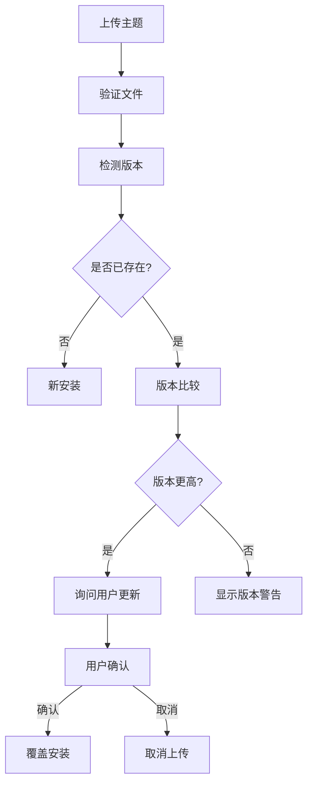

import { Callout } from "fumadocs-ui/components/callout";

本文档定义了安知鱼主题系统的开发规范，包括主题文件结构、约定文件格式以及开发要求。

## API 文档

https://s.apifox.cn/e8218a9e-0538-443f-81bd-267a7a2f32a6

## 🎯 主题文件结构

每个主题压缩包必须包含以下文件结构：

```
theme-name.zip
├── theme.json          # 主题信息约定文件（必需）
├── index.html          # 主题入口文件（必需）
├── static/             # 静态资源目录（必需）
│   ├── css/           # 样式文件
│   │   ├── *.css      # CSS文件
│   │   ├── *.scss     # SCSS文件（可选）
│   │   ├── *.sass     # SASS文件（可选）
│   │   └── *.less     # LESS文件（可选）
│   ├── js/            # 脚本文件
│   │   ├── *.js       # JavaScript文件
│   │   ├── *.ts       # TypeScript文件（可选）
│   │   └── *.gz       # 压缩文件（可选）
│   ├── images/        # 图片资源
│   │   ├── *.jpg/.jpeg/.png/.gif/.webp/.svg  # 图片文件
│   │   └── *.ico      # 图标文件
│   └── fonts/         # 字体文件
│       └── *.ttf/.otf/.woff/.woff2/.eot  # 字体文件
├── preview.jpg         # 主题预览图（推荐，用于商城展示）
├── screenshots/        # 截图目录（可选）
│   ├── screenshot-1.jpg  # 额外截图
│   └── screenshot-2.jpg  # 额外截图
└── README.md          # 说明文档（推荐）
```

### 📋 文件结构说明

- **必需文件**：`theme.json`、`index.html`、`static/` 目录
- **推荐文件**：`preview.jpg`、`README.md`
- **可选文件**：额外截图、字体文件、预编译资源
- **支持嵌套**：主题文件可以在 ZIP 根目录下的子文件夹中（系统会自动检测）

## 📄 主题信息约定文件（theme.json）

### 完整示例

```json
{
  "name": "theme-example-blog",
  "displayName": "示例博客主题",
  "version": "1.0.0",
  "description": "这是一个示例博客主题，展示了主题开发的基本结构和功能。",
  "author": {
    "name": "安知鱼",
    "email": "anzhiy@anheyu.com",
    "url": "https://anheyu.com"
  },
  "license": "MIT",
  "homepage": "https://github.com/anzhiyu-c/theme-example-blog",
  "repository": {
    "type": "git",
    "url": "https://github.com/anzhiyu-c/theme-example-blog.git"
  },
  "keywords": ["博客", "响应式", "现代化", "简洁"],
  "category": "blog",
  "screenshots": "https://upload-bbs.miyoushe.com/upload/2025/09/18/125766904/359dbf5b0ce07e56a960b31063c44280_4491727436207297404.png",
  "engines": {
    "anheyu": ">=1.0.0"
  },
  "features": ["responsive-design", "dark-mode", "seo-friendly", "customizable-colors"]
}
```

### 字段说明

#### 基本信息（必需）

| 字段          | 类型          | 必需 | 说明                                                         |
| ------------- | ------------- | ---- | ------------------------------------------------------------ |
| `name`        | string        | ✅   | 主题标识名，必须以 `theme-` 开头，只能包含字母、数字、连字符 |
| `displayName` | string        | ✅   | 主题显示名称                                                 |
| `version`     | string        | ✅   | 主题版本，遵循语义化版本规范                                 |
| `description` | string        | ✅   | 主题描述                                                     |
| `author`      | object/string | ✅   | 作者信息                                                     |

#### 作者信息

```json
{
  "author": {
    "name": "作者姓名",
    "email": "author@example.com",
    "url": "https://author-website.com"
  }
}
```

或简化格式：

```json
{
  "author": "作者姓名 <author@example.com>"
}
```

#### 可选信息

| 字段          | 类型          | 说明                             |
| ------------- | ------------- | -------------------------------- |
| `license`     | string        | 许可证类型（如：MIT、GPL-3.0）   |
| `homepage`    | string        | 主题主页地址                     |
| `repository`  | object        | 代码仓库信息                     |
| `keywords`    | array(string) | 关键词标签，用于搜索和分类       |
| `category`    | string        | 主题分类                         |
| `screenshots` | string\|array | 截图文件路径（支持字符串或数组） |
| `engines`     | object        | 系统版本要求                     |
| `features`    | array(string) | 支持的功能特性列表               |

#### 字段详细说明

**repository 字段（代码仓库信息）：**

```json
"repository": {
  "type": "git",
  "url": "https://github.com/user/theme-name.git"
}
```

**screenshots 字段支持多种格式：**

```json
// 单个截图（字符串URL）
"screenshots": "https://example.com/preview.jpg"

// 单个本地文件
"screenshots": "preview.jpg"

// 多个截图（数组）
"screenshots": [
  "preview.jpg",
  "screenshot-1.jpg",
  "screenshot-2.jpg"
]
```

**engines 字段（系统要求）：**

```json
"engines": {
  "anheyu": ">=1.0.0"
}
```

**features 字段（功能特性）：**

```json
"features": [
  "responsive-design",
  "dark-mode",
  "seo-friendly",
  "customizable-colors"
]
```

## ✅ 验证规则

### 1. 文件结构验证

#### 必需文件检查

- ✅ 必须包含 `theme.json` 文件
- ✅ 必须包含 `index.html` 文件
- ⚠️ 强烈建议包含 `static/` 目录（缺少时显示警告）
- ✅ 支持嵌套目录结构（自动检测主题文件位置）

#### 文件大小限制

- 压缩包总大小：不超过 **50MB**
- 单个文件大小：建议不超过 **10MB**
- 主题解压后大小：建议不超过 **100MB**

#### 文件结构自动检测

- 系统会自动检测 ZIP 包中的主题文件位置
- 支持根目录直接包含主题文件
- 支持单层子目录包含主题文件（如 `theme-name/theme.json`）

### 2. theme.json 验证

#### JSON 格式验证

- ✅ 必须是有效的 JSON 格式
- ✅ 编码必须为 UTF-8
- ✅ 必须包含所有必需字段

#### 必需字段验证

| 字段          | 验证规则                                             |
| ------------- | ---------------------------------------------------- |
| `name`        | 必须以 `theme-` 开头，只能包含小写字母、数字、连字符 |
| `displayName` | 不能为空，建议长度不超过 50 字符                     |
| `version`     | 必须符合语义化版本规范（如：1.0.0）                  |
| `description` | 不能为空，建议长度不超过 200 字符                    |
| `author`      | 必须提供作者信息（字符串或对象）                     |

#### 主题名称规则

```regex
^theme-[a-z0-9\-]+$
```

- 必须以 `theme-` 开头
- 只能包含小写字母、数字和连字符
- 不能包含空格或特殊字符
- 长度建议在 6-50 字符之间

#### 版本号规则

```regex
^\d+\.\d+\.\d+(-[a-zA-Z0-9\-\.]+)?$
```

- 基本格式：`主版本号.次版本号.修订号`
- 支持预发布版本：`1.0.0-beta.1`
- 支持构建版本：`1.0.0-20250919`

### 3. 安全验证

#### 路径安全检查

- ❌ 禁止包含路径遍历：`../`、`..\\`
- ❌ 禁止绝对路径
- ❌ 禁止超出主题目录的路径引用
- ✅ 自动跳过系统文件（`__MACOSX/`、`._*`）

#### 文件类型白名单

**允许的文件类型：**

- **网页文件**：`.html`, `.htm`
- **样式文件**：`.css`, `.scss`, `.sass`, `.less`
- **脚本文件**：`.js`, `.ts`
- **配置文件**：`.json`, `.xml`, `.yml`, `.yaml`
- **图片文件**：`.jpg`, `.jpeg`, `.png`, `.gif`, `.svg`, `.webp`, `.ico`
- **字体文件**：`.ttf`, `.otf`, `.woff`, `.woff2`, `.eot`
- **文档文件**：`.md`, `.txt`
- **压缩文件**：`.gz`, `.br`（用于构建优化）

#### 文件类型黑名单

**严格禁止的文件类型：**

- **可执行文件**：`.exe`, `.bat`, `.sh`, `.cmd`, `.com`
- **服务器脚本**：`.php`, `.asp`, `.jsp`, `.py`, `.rb`
- **系统文件**：`.dll`, `.so`, `.dylib`
- **归档文件**：`.zip`, `.rar`, `.tar`, `.7z`

### 4. 内容验证

#### HTML 文件验证

- ✅ `index.html` 必须包含基本 HTML 结构
- ✅ 必须包含 `<!DOCTYPE html>` 或 `<html>` 标签
- ✅ 必须包含 `<head>` 和 `<body>` 标签
- ✅ 文件内容不能为空

#### 主题分类验证

支持的主题分类（category 字段）：

```
blog, portfolio, business, magazine, minimal,
creative, photography, education, technology, other
```

#### 截图文件验证

- 支持相对路径引用
- 自动检测第一个截图作为预览图
- 支持多种图片格式

## 🔒 安全要求

### 1. 文件类型安全控制

#### 白名单机制（严格控制）

<Callout type="warning">系统采用白名单机制，只允许安全的文件类型上传和使用。</Callout>

**网页与样式文件：**

- `.html`, `.htm` - 网页文件
- `.css` - 样式表文件
- `.scss`, `.sass`, `.less` - 预编译样式文件

**脚本文件：**

- `.js` - JavaScript 文件
- `.ts` - TypeScript 文件

**配置与数据文件：**

- `.json` - JSON 配置文件
- `.xml` - XML 配置文件
- `.yml`, `.yaml` - YAML 配置文件

**媒体文件：**

- `.jpg`, `.jpeg`, `.png`, `.gif` - 常规图片格式
- `.svg` - 矢量图形文件
- `.webp` - 现代图片格式
- `.ico` - 图标文件

**字体文件：**

- `.ttf`, `.otf` - TrueType/OpenType 字体
- `.woff`, `.woff2` - Web 字体格式
- `.eot` - IE 兼容字体格式

**文档文件：**

- `.md` - Markdown 文档
- `.txt` - 纯文本文件

**构建优化文件：**

- `.gz` - Gzip 压缩文件
- `.br` - Brotli 压缩文件

#### 黑名单机制（严格禁止）

以下文件类型被严格禁止：

**可执行文件：**

- `.exe`, `.msi` - Windows 可执行文件
- `.bat`, `.cmd` - Windows 批处理文件
- `.sh` - Shell 脚本文件
- `.com` - DOS 可执行文件

**服务器端脚本：**

- `.php` - PHP 脚本
- `.asp`, `.aspx` - ASP 脚本
- `.jsp` - Java Server Pages
- `.py` - Python 脚本
- `.rb` - Ruby 脚本

**系统文件：**

- `.dll` - 动态链接库
- `.so` - Linux 共享对象
- `.dylib` - macOS 动态库

**归档文件：**

- `.zip`, `.rar`, `.7z` - 压缩包文件
- `.tar`, `.gz`（非构建输出） - 打包文件

#### 文件名安全检查

- ❌ 禁止包含特殊字符：`<>:"|?*`
- ❌ 禁止以点开头的隐藏文件（系统文件除外）
- ❌ 禁止超长文件名（>255 字符）
- ✅ 自动忽略系统文件：`__MACOSX/`, `._*`

### 2. 路径安全验证

#### 路径遍历防护

- ❌ 严格禁止路径遍历：`../`, `..\\`
- ❌ 禁止绝对路径引用
- ❌ 禁止超出主题目录的引用
- ✅ 所有路径必须相对于主题根目录

#### 目录结构验证

```bash
# 允许的目录结构
theme-name/
├── theme.json          ✅ 根目录配置文件
├── index.html          ✅ 根目录HTML文件
└── static/             ✅ 静态资源目录
    ├── css/            ✅ 样式文件目录
    ├── js/             ✅ 脚本文件目录
    ├── images/         ✅ 图片资源目录
    └── fonts/          ✅ 字体文件目录

# 禁止的目录结构
theme-name/
├── ../config.php       ❌ 路径遍历
├── /etc/passwd         ❌ 绝对路径
└── scripts/
    └── malware.exe     ❌ 可执行文件
```

### 3. 内容安全审查

#### HTML 内容安全

- ✅ 基本 HTML 结构完整性检查
- ❌ 禁止内联 JavaScript 恶意代码
- ❌ 禁止外部恶意资源引用
- ⚠️ 警告过多外部 CDN 依赖

#### JavaScript 安全检查

- ❌ 禁止明显的恶意代码模式
- ❌ 禁止文件系统访问尝试
- ❌ 禁止网络请求到可疑域名
- ⚠️ 检查混淆代码（给出警告）

#### CSS 安全检查

- ❌ 禁止 CSS 中的 JavaScript 执行
- ❌ 禁止外部字体文件恶意引用
- ✅ 检查 CSS 语法有效性

### 4. 版权与合规

#### 内容合规要求

- ❌ 禁止包含色情、暴力等不当内容
- ❌ 禁止侵犯他人版权的素材
- ❌ 禁止恶意、欺诈性内容
- ✅ 鼓励使用开源或自有素材

#### 许可证要求

- ✅ 建议明确标注使用的开源许可证
- ✅ 建议声明第三方资源的版权信息
- ⚠️ 注意字体文件的使用许可

### 5. 上传安全机制

#### 实时扫描

- 上传时进行病毒扫描
- 文件类型深度检测（不仅检查扩展名）
- 压缩包内容递归安全检查

#### 沙箱验证

- 主题在隔离环境中初步加载测试
- 检测运行时异常和错误
- 验证资源引用的有效性

## 🛠️ 开发建议

### 1. 性能优化

- 压缩 CSS 和 JavaScript 文件
- 优化图片大小和格式
- 使用 CDN 加载外部资源
- 实现懒加载功能

### 2. 兼容性

- 支持现代浏览器
- 提供降级方案
- 测试移动端兼容性
- 考虑网络条件较差的用户

### 3. 用户体验

- 提供清晰的文档说明
- 设计直观的配置选项
- 提供多种布局选择
- 确保加载速度

### 4. 维护性

- 使用语义化的代码结构
- 提供详细的注释
- 遵循编码规范
- 版本控制管理

## 📝 示例主题

以下是一个最小化的主题示例：

### theme.json

```json
{
  "name": "theme-minimal",
  "displayName": "极简主题",
  "version": "1.0.0",
  "description": "一个简洁优雅的博客主题",
  "author": {
    "name": "安知鱼",
    "email": "anzhiy@anheyu.com",
    "url": "https://anheyu.com"
  },
  "license": "MIT",
  "category": "minimal",
  "keywords": ["简洁", "博客", "响应式"],
  "features": ["responsive-design", "dark-mode", "seo-friendly"]
}
```

## 🚀 主题上传与管理

### 主题上传流程

#### 1. 准备阶段

- ✅ 确保主题功能完整，通过本地测试
- ✅ 完善 theme.json 配置文件
- ✅ 添加 README.md 说明文档
- ✅ 优化主题文件大小（建议 < 10MB）

#### 2. 打包压缩

```bash
# 创建主题压缩包
zip -r theme-name.zip theme-name/
# 或者直接压缩主题文件
zip -r theme-name.zip theme.json index.html static/ README.md preview.jpg
```

#### 3. 系统上传

1. **访问主题商城** - 进入系统后台主题商城页面
2. **点击上传按钮** - 选择"上传主题"功能
3. **选择 ZIP 文件** - 拖拽或选择主题压缩包
4. **自动验证** - 系统自动验证主题文件完整性和安全性
5. **版本检测** - 自动检测是否为已安装主题的更新版本

#### 4. 版本管理机制

<Callout type="info">系统支持智能版本检测和更新管理</Callout>

**新主题安装：**

- 系统验证通过后直接安装
- 自动生成主题记录并标记为已安装
- 支持立即启用或稍后手动启用

**主题更新流程：**



**版本比较规则：**

- 遵循语义化版本规范（Major.Minor.Patch）
- 支持预发布版本标识（如：1.0.0-beta.1）
- 高版本覆盖低版本，需用户确认
- 同版本重新安装需用户确认

### 主题管理功能

#### 1. 已安装主题管理

- **主题列表查看** - 显示所有已安装主题
- **主题切换** - 一键切换不同主题
- **主题卸载** - 删除不需要的主题（当前使用主题除外）
- **版本信息** - 显示安装版本和安装时间

#### 2. 主题状态管理

```bash
# 主题状态类型
- 当前使用 (is_current: true)  - 绿色标识
- 已安装   (is_installed: true) - 普通显示
- 官方主题 (isOfficial: true)   - 特殊标识
```

#### 3. 静态模式检测

- **静态模式激活**：存在 `static/` 目录时，使用用户安装的主题
- **官方模式**：不存在 `static/` 目录时，使用内置官方主题
- **状态一致性修复**：自动检测和修复主题状态不一致问题

## 💡 常见问题

### Q: 主题名称有什么要求？

A: 主题名称必须以 `theme-` 开头，只能包含小写字母、数字和连字符，不能包含空格或特殊字符。例如：`theme-blog-minimal`、`theme-portfolio-2024`。

### Q: 上传的主题包大小有限制吗？

A: 有限制。压缩包总大小不能超过 50MB，单个文件建议不超过 10MB。建议优化图片和压缩静态资源以减小文件大小。

### Q: 支持嵌套目录结构吗？

A: 支持。系统会自动检测 ZIP 包中主题文件的位置，支持根目录直接包含主题文件，也支持在子目录中包含主题文件。

### Q: 如何处理主题版本更新？

A: 系统支持智能版本检测：

- 上传相同主题名的更高版本时，会提示用户确认更新
- 支持语义化版本比较（1.1.0 > 1.0.0）
- 更新会覆盖原主题文件，但用户配置保留

### Q: 可以使用外部 CDN 资源吗？

A: 可以，但有以下建议：

- 将关键资源本地化，确保离线环境正常工作
- 外部资源建议使用 HTTPS 协议
- 注意 CDN 资源的加载速度和稳定性

### Q: 主题切换后页面不生效怎么办？

A: 主题切换涉及静态文件更新，可能需要：

- 清除浏览器缓存（Ctrl+F5 强制刷新）
- 等待系统处理完成（通常几秒钟）
- 检查静态文件是否正确部署

### Q: 如何处理主题的多语言支持？

A: 在 theme.json 中声明 `translation-ready` 特性，并在主题中提供多语言资源文件。

### Q: 主题开发时如何本地测试？

A: 建议开发流程：

1. 本地搭建测试环境
2. 直接将主题文件放入 `static/` 目录测试
3. 测试通过后打包上传
4. 在实际环境中最终验证

### Q: 主题删除后还能恢复吗？

<Callout type="warning">主题删除是不可逆操作，建议删除前确认备份重要主题。</Callout>

A: 主题删除是不可逆操作，会同时删除：

- 主题文件（themes/目录下的文件）
- 数据库中的安装记录

建议删除前确认备份重要主题。

### Q: 为什么我的主题在商城中显示不完整？

A: 可能的原因：

- theme.json 缺少必要字段信息
- 预览图路径不正确或文件不存在
- 主题商城 API 数据未同步

建议检查 theme.json 配置的完整性。

---

遵循本规范开发的主题将能够在安知鱼系统中正常运行，并为用户提供最佳的使用体验。
